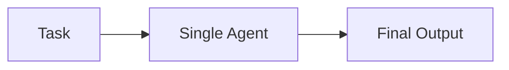
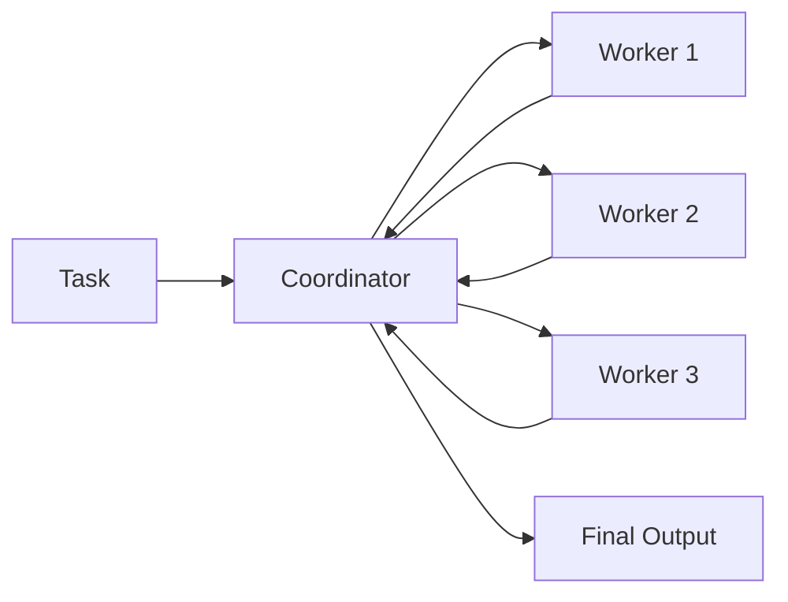
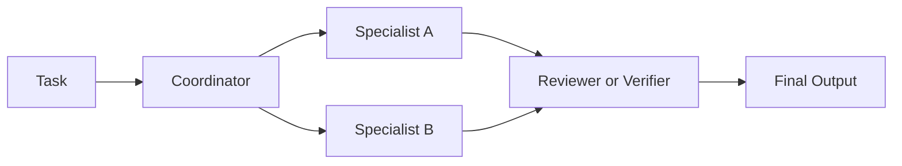
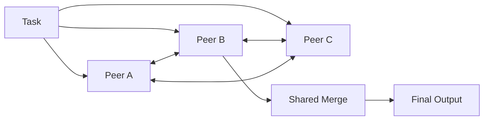
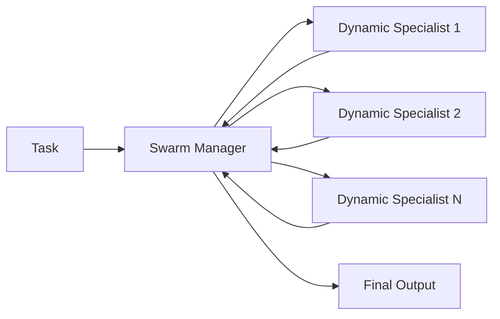

# Agentic Architectures

This note complements the main [README](./README.md) with a quick reference for the architecture styles this project is designed to compare.

The framing is influenced by Google's paper, [Towards a Science of Scaling Agent Systems: When and Why Agent Systems Work](https://research.google/blog/towards-a-science-of-scaling-agent-systems-when-and-why-agent-systems-work/), especially the idea that multi-agent structure should be evaluated against task shape rather than treated as universally better.

## Why This File Exists

The dashboard compares architectures on metrics such as:

- quality and rubric score
- wall-clock latency
- token usage
- CPU and memory pressure
- coordination overhead like handoffs and review loops

Different task shapes reward different orchestration styles, so this file gives a compact mental model for each one.

## Architecture Patterns

### Single Agent

Best for tightly sequential tasks where one uninterrupted reasoning thread matters more than delegation.

### Centralized

Best when a coordinator can split the work into bounded, mostly independent subproblems and merge the results.

### Hybrid

Best when delegation helps, but a final review or verification pass materially improves trustworthiness.

### Decentralized

Best treated as an experimental mode for peer-style collaboration, negotiation, or consensus-heavy tasks.

### Dynamic Swarm

Best for open-ended incident response or exploratory problem solving where the right specialists are only knowable after the task begins.

## Rule of Thumb

- Use `single` when the task is highly sequential.
- Use `centralized` when the task decomposes cleanly.
- Use `hybrid` when correctness depends on an independent check.
- Use `decentralized` when consensus and peer negotiation are part of the task itself.
- Use `dynamic_swarm` when the investigation path has to adapt mid-flight.

## How This Repo Maps to Those Ideas

In this repository:

- the API defines benchmark tasks and exposes run endpoints
- the LangGraph runner simulates or executes architecture-specific flows
- the web app visualizes traces, node activity, and outcome metrics
- the shared package keeps architecture labels and telemetry types consistent across both apps

The goal is not just to show that agents can collaborate, but to make it easier to see when extra coordination actually helps and when it only adds overhead.
