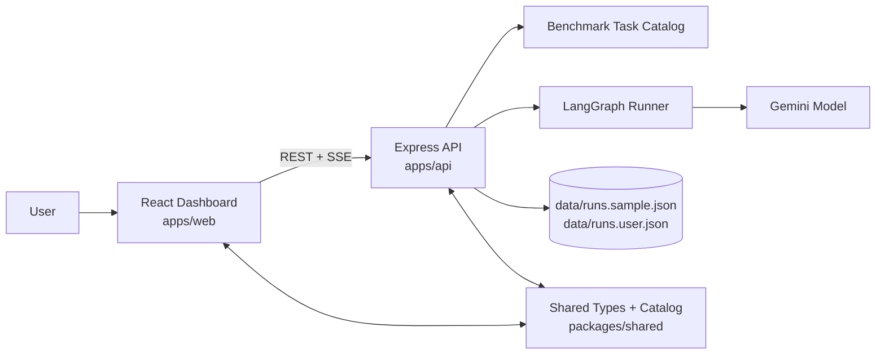

# Agent Visibility Project

**Live Demo**: [https://agentic-ai-architectures-web.vercel.app/](https://agentic-ai-architectures-web.vercel.app/)

[](https://www.youtube.com/watch?v=uZfRaBMX8JU)

Inspired by Google's paper, [Towards a Science of Scaling Agent Systems: When and Why Agent Systems Work](https://research.google/blog/towards-a-science-of-scaling-agent-systems-when-and-why-agent-systems-work/), this project explores how different agentic architectures behave on benchmark tasks and makes their tradeoffs visible through a live dashboard.

It combines a small benchmarking API, a React visualization layer, shared experiment schemas, and JSON-backed run storage so you can compare architectures like `single`, `centralized`, `hybrid`, `decentralized`, and `dynamic_swarm` across quality, latency, token usage, and coordination overhead.

## What It Does

- Enables **parallel execution** of multiple agent architectures for direct live comparison
- Supports **user-defined custom benchmark tasks** alongside pre-configured tasks
- Streams live execution progress from the API to a high-density, data-rich UI
- Visualizes architecture behavior, handoffs, granular evaluation metrics (e.g., Confidence, Test Reliability), and resource metrics
- Stores sample and user-generated runs in JSON for easy iteration
- Uses a LangGraph + Gemini runner for live benchmark experiments

## Architecture



More on the agent-pattern side of the project lives in [AGENTIC_ARCHITECTURES.md](./AGENTIC_ARCHITECTURES.md).

## Tech Used

- TypeScript across the full workspace
- React 19 + Vite for the dashboard
- Express for the API
- LangGraph + `@langchain/google` for orchestration and model execution
- Recharts for performance charts
- `@xyflow/react` + Framer Motion for animated agent graphs
- Zod for runtime validation
- JSON files for persisted benchmark runs

## Local Deployment

### Prerequisites

- Node.js 20+
- npm
- A Gemini or Google API key if you want live benchmark execution

### Setup

1. Install dependencies:

```bash
npm install
```

2. Create your local environment file from the example:

```bash
cp .env.example .env.local
```

3. Add at least one of these keys to `.env.local`:

```bash
GEMINI_API_KEY=your_key_here
# or
GOOGLE_API_KEY=your_key_here
```

4. Optional frontend flags:

```bash
VITE_IS_PROD_DEPLOYMENT=false
VITE_API_BASE_URL=
```

- `VITE_API_BASE_URL` can stay empty for local development because Vite proxies `/api` and `/health` to `http://localhost:4000`.
- `VITE_IS_PROD_DEPLOYMENT` when set to `true` enforces a concurrency limit (max 3 architectures at a time) to preserve server resources.

### Run Locally

Start the API in one terminal:

```bash
npm run dev:api
```

Start the web app in a second terminal:

```bash
npm run dev:web
```

Then open:

- Dashboard: `http://localhost:5173`
- API health check: `http://localhost:4000/health`

### Build

```bash
npm run build
```

### Typecheck

```bash
npm run typecheck
```

## Directory Structure

```text
agent-visibility-project/
├── apps/
│   ├── api/                 # Express API, benchmark routes, live runner, storage hooks
│   └── web/                 # React + Vite dashboard and animated architecture views
├── packages/
│   └── shared/              # Shared types, architecture catalog, tool definitions
├── data/
│   ├── runs.sample.json     # Seed/sample benchmark dataset
│   └── runs.user.json       # Locally persisted live benchmark runs
├── .env.example             # Example environment variables
└── AGENTIC_ARCHITECTURES.md # Agent-pattern notes and diagrams
```

## Notes

- The API merges sample runs with locally observed runs when building the overview payload.
- Live comparisons are streamed with Server-Sent Events from `/api/benchmark-stream`.
- If no API key is configured, the project can still be useful as a visualization shell for sample data.
